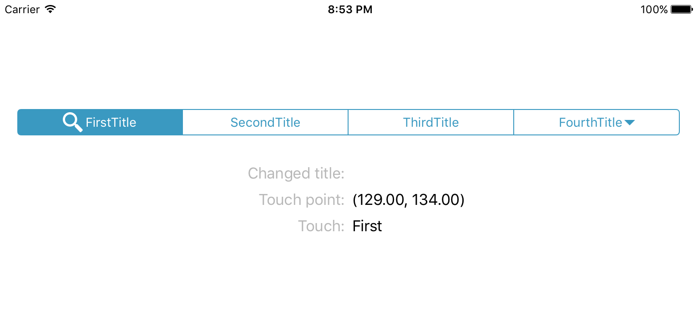
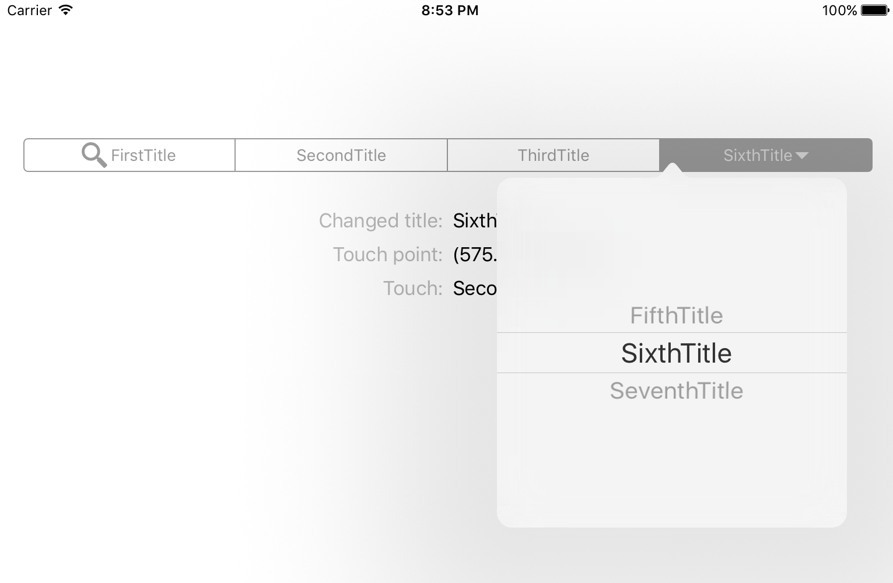

# AZSegmentedControl
AZSegmentedControl inherited from UISegmentedControl.
## Opportunities:

- [x] You can simultaneous display of image and text in segment.
- [x] You can use second touch on segment
- [x] You can see and use touch point

## Add to project:

+ Download AZSegmentedControl.zip an unzip
+ Add unzipped files to your project
+ Import AZSegmentedControl header file:
```objectivec
#import <AZSegmentedControl.h>
```

##Usage

- [x] If needed You can add custom font:  

```objectivec
UIFont *font = [UIFont systemFontOfSize:14];
[self.segmentedControl setFont:font];
```

- [x] And of course add image and text, if needed you can add image offsets. Image can be positioned to left or right from text.

```objectivec
UIImage *firstImage     = [UIImage imageNamed:@"search"];
NSString *firstTitle    = @"FirstTitle";

[self.segmentedControl setImage: firstImage
                           fromSide: SegmentedImageSideLeft // from left - SegmentedImageSideLeft or right - SegmentedImageSideRight 
                   horizontalOffSet: 3.f
                     verticalOffSet: 0.f
                           andTitle: firstTitle
                  forSegmentAtIndex: 0];    
    
```

# ScreenShots

<p align='center'>
  
  
</p>

